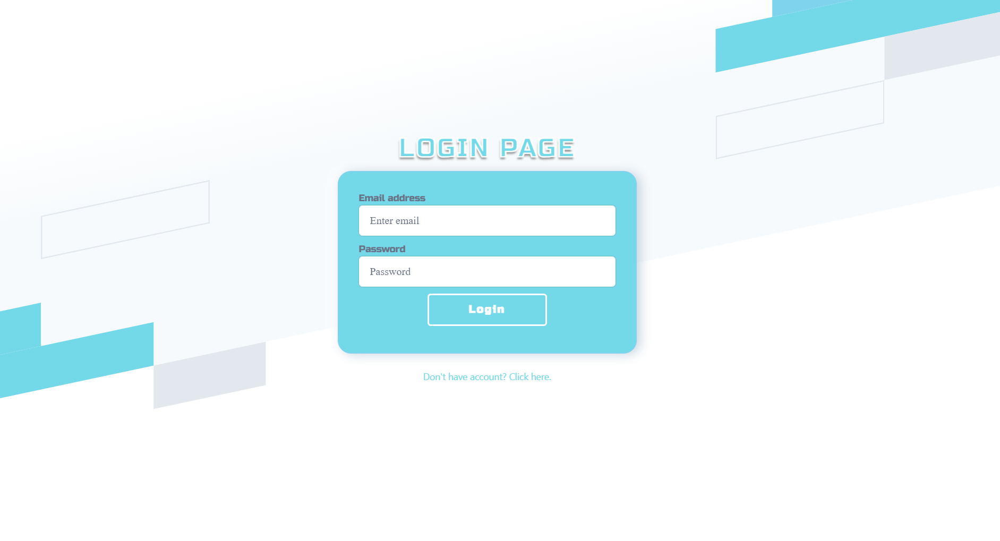
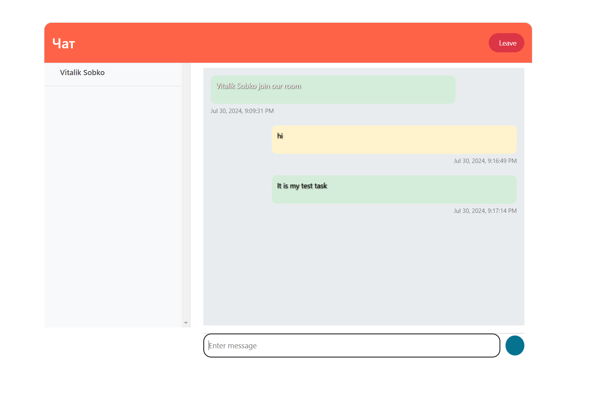

# Reenbit.TestTask

## This project was created as a test task for intern position at Reenbit

## Used Technologies

- **ASP.NET**
- **Angular**
- **PostgreSQL**
- **Bootstrap**
- **Azure App Service**
- **Azure Database for PostgreSQL servers**
- **Azure SignalR**
- **Azure Cognitive Services Text Analytics**
- **Azure Key Vault**

## User Instructions

- Go to the [https://frontpart.azurewebsites.net/login](https://frontpart.azurewebsites.net/login)

- Register or log in, it may take a few seconds to load

    - Use valid data:

    - email address must contain @gmail.com or another valid domain

    - password must contain at least 8 characters

- Here you can receive and send messages

- To exit, just press the exit button
